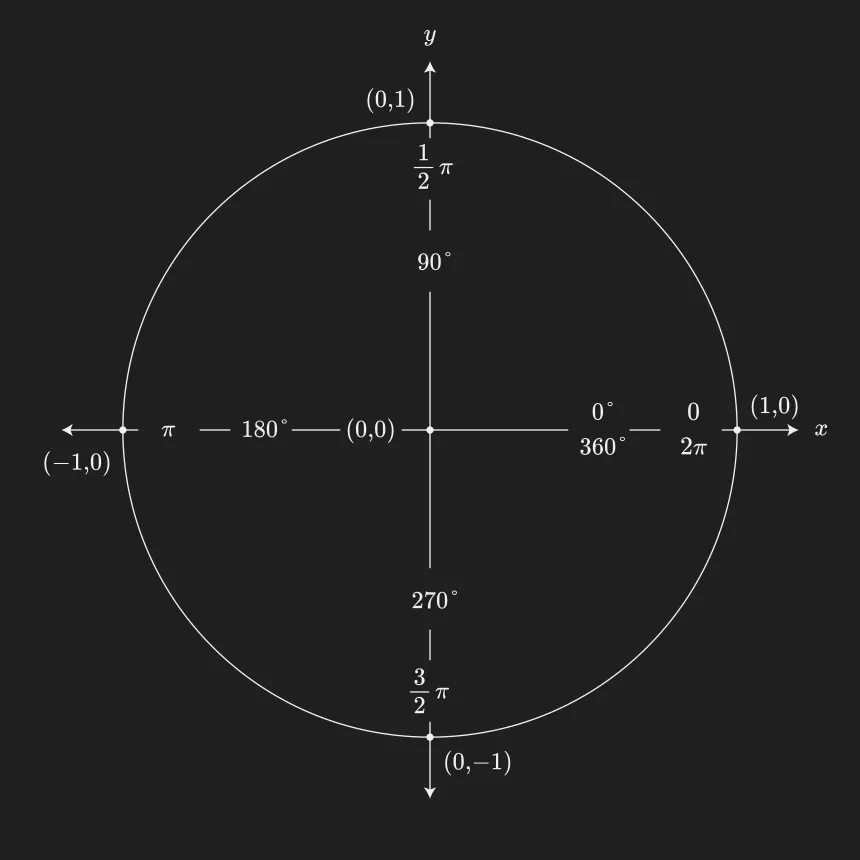
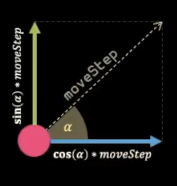
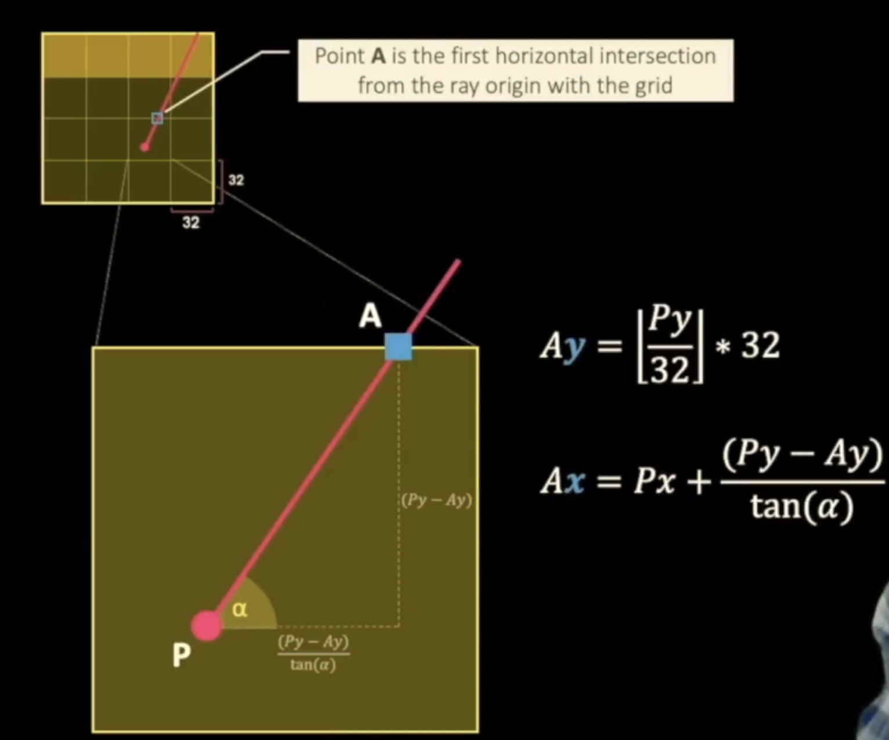
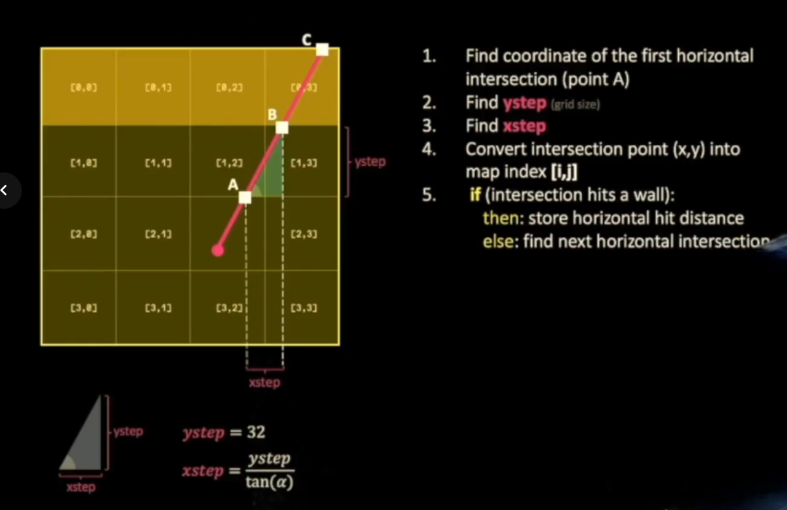
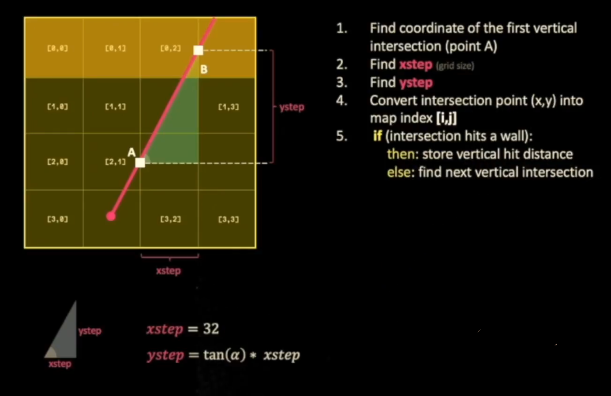
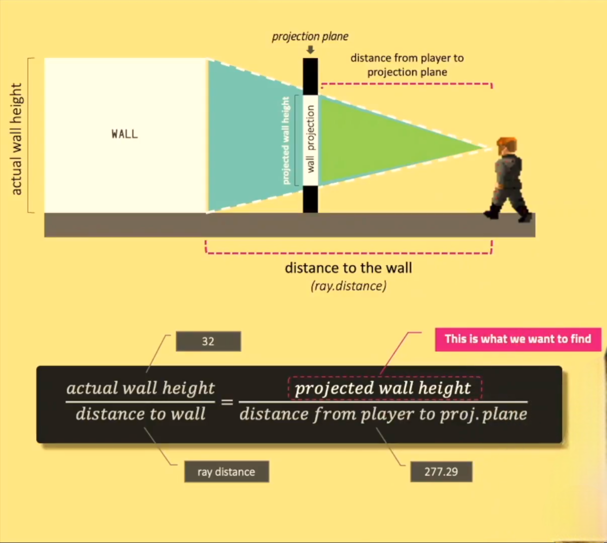

<div align="center" id="top"> 
  

  &#xa0;

  <!-- <a href="https://cook3d.netlify.app">Demo</a> -->
</div>

<h1 align="center">Cook3D</h1>

<p align="center">
  

  

  


  <!--  -->

  

  <!--  -->
</p>

<!-- Status -->

<h4 align="center"> 
	🚧  Cook3D 🚀 Under construction...  🚧
</h4> 

<hr>

<p align="center">
  <a href="#dart-about">About</a> &#xa0; | &#xa0; 
  <a href="#sparkles-features">Features</a> &#xa0; | &#xa0;
  <a href="#rocket-technologies">Technologies</a> &#xa0; | &#xa0;
  <a href="#white_check_mark-requirements">Requirements</a> &#xa0; | &#xa0;
  <a href="#checkered_flag-starting">Starting</a> &#xa0; | &#xa0;
  <a href="#walking_man-walk-through">walk through</a> &#xa0; | &#xa0;
  <a href="https://github.com/ism417" target="_blank">Author</a>
</p>

<br>

## :dart: About ##

This project is inspired by the world-famous Wolfenstein 3D game, which
was the first FPS ever. It enable me to explore ray-casting. My goal was to
make a dynamic view inside a maze, in which you’ll have to find your way.

## :sparkles: Features ##

:heavy_check_mark: minimap\
:heavy_check_mark: move with the arrows up and down or W, A, S, and D keys \
:heavy_check_mark: The left and right arrow keys of the keyboard allow you to look left and
right in the maze;

## :rocket: Technologies ##

The following tools were used in this project:

- [miniLibX](https://harm-smits.github.io/42docs/libs/minilibx)

## :white_check_mark: Requirements ##

Before starting :checkered_flag:, you need to have [brew](https://brew.sh/) and [glfw]() installed.

## :checkered_flag: Starting ##

```bash
# Clone this project
$ git clone https://github.com/ism417/cook3d

# Access
$ cd cook3d

# Install brew
$ /bin/bash -c "$(curl -fsSL https://raw.githubusercontent.com/Homebrew/install/HEAD/install.sh)"

# Install glfw
$ brew install glfw

# Run the project
$ make && ./cub3D map.cub

```
## :walking_man: Walk through ##

After parsing the map file, i initialize the window and the image, And some variables like where the player looking 
```c
void chose_angle(t_game *data, char p)
{
	if (p == 'S')
		data->ply.rotation_angle = M_PI / 2;
	if (p == 'N')
		data->ply.rotation_angle = 3 * (M_PI / 2);
	if (p == 'W')
		data->ply.rotation_angle = M_PI;
	if (p == 'E')
		data->ply.rotation_angle = 0;
	data->ply.side_angle = data->ply.rotation_angle + (M_PI /2);
}
```


I then create a loop that will run until the window is closed. i update the player position and direction in this loop. I also check for key presses to update the player position and direction accordingly.
  
  ```c
  void ft_move(t_game *data)
{
	data->ply.turn_direction = 0;
	data->ply.side_direction = 0;
	data->ply.walk_direction = 0;
	if (mlx_is_key_down(data->mlx, MLX_KEY_ESCAPE))
		mlx_close_window(data->mlx);
	if (mlx_is_key_down(data->mlx, MLX_KEY_UP) || mlx_is_key_down(data->mlx, MLX_KEY_W))
		data->ply.walk_direction = +1;
	if (mlx_is_key_down(data->mlx, MLX_KEY_DOWN) || mlx_is_key_down(data->mlx, MLX_KEY_S))
		data->ply.walk_direction = (-1);
	if (mlx_is_key_down(data->mlx, MLX_KEY_LEFT))
		data->ply.turn_direction = (-1);
	if (mlx_is_key_down(data->mlx, MLX_KEY_RIGHT))
		data->ply.turn_direction = (+1);
	if (mlx_is_key_down(data->mlx, MLX_KEY_A))
		data->ply.side_direction = (-1);
	if (mlx_is_key_down(data->mlx, MLX_KEY_D))
		data->ply.side_direction = (+1);
	rebiuld(data); // update the images (the image where I rendar the walls and the image where I draw rays)
	data->ply.rotation_angle += data->ply.turn_direction * data->ply.rotationSpeed;
	data->ply.side_angle += data->ply.turn_direction * data->ply.rotationSpeed; 
}
  ```
After that I see if the player is trying side ways or forward and update the player position accordingly.
```c
  data->ply.movestep = data->ply.walk_direction * data->ply.move_speed;
	if (data->ply.movestep == 0)
	{
		data->ply.movestep = data->ply.side_direction * data->ply.move_speed;
		newx = data->player->instances->x + round(cos(data->ply.side_angle) * data->ply.movestep);
		newy = data->player->instances->y + round(sin(data->ply.side_angle) * data->ply.movestep);
	}
	else
	{
		newx = data->player->instances->x + round(cos(data->ply.rotation_angle) * data->ply.movestep);
		newy = data->player->instances->y + round(sin(data->ply.rotation_angle) * data->ply.movestep);	
	}

```


I then check for collisions with the walls.
with the following function
```c
bool phaswall(double x, double y, t_game *data)
{
	int cell_x;
	int cell_y;
	
	if (x < 0 || x > (data->w * CELL) || y < 0 || y > (data->h * CELL))
		return (true);
	int dx = 0; 
	while(dx < PLAYER)
	{
		int dy = 0;
		while (dy < PLAYER)
		{
			cell_x = floor((x + dx) / CELL);
			cell_y = floor((y + dy) / CELL);
			if (data->map[cell_y][cell_x] == '1')
				return (true);
			dy += PLAYER - 1;
		}
		dx += PLAYER - 1;
	}
	return (false);
}
```
And then update the player position accordingly.

I then cast rays to find the distance to the walls and draw them on the screen.
* casting rays\
loop through the screen width and for each column I cast a ray. I calculate the angle of each ray and normaize it and check where the player looking up or down or left or right with the following function
```c
void norm_engle(t_game *data, double *angle)
{
	*angle = remainder(*angle , (2 * M_PI));
	if (*angle < 0)
		*angle = (2 * M_PI) + *angle;
	if (*angle > 0 && *angle < M_PI)
		data->down = true;
	else
		data->down = false;
	if (*angle < 0.5 * M_PI || *angle > 1.5 * M_PI)
		data->right = true;
	else
		data->right = false;
	data->left   = !data->right;
	data->up     = !data->down;
	
}
```
Then I search the x and y of the herizontal and vertical wall hit and i calculate the distance and choose the shortest distance.

first I calculate the x and y of the first wall hit with the following function



Then we calculate the herizontal intersections



Then we calculate the vertical intersections



Then we choose the shortest distance

And I draw a ray from the player to that x and y.
with the following function
```c
void draw_line(mlx_image_t *mlx, int x0, int y0, int x1, int y1, int color)
{
	int dy = y1 - y0;
	int dx = x1 - x0;
	int steps = 0;;
	float	x_inc = 0;
	float	y_inc = 0;
	int i = 0;
	float y = y0;
	float x = x0;

	if (abs(dx) > abs(dy))
		steps = abs(dx);
	else 
		steps = abs(dy);
	x_inc = (float)dx / (float)steps;
	y_inc = (float)dy / (float)steps;
	while(i < steps && y >= 0 && x >= 0)
	{
		mlx_put_pixel(mlx, round(x), round(y), color);
		x += x_inc;
		y += y_inc;
		i++;
	}
}
```

those x and y for each ray are stored in an array and then I draw the walls on the screen with the following function
```c
void reander_walls(t_game *data, double **rays)
{
	double *ray;
	double dis;
	double dis_plane;
	double wall_height;
	double angle;
	int i;

	i = 0;
	angle = data->ply.rotation_angle - (FOV_ANGLE / 2);
	while (i < NUM_RAYS)
	{
		data->color = rays[i][2];
		ray = rays[i];
		dis = distance(data->x, data->y, ray[0], ray[1]) * cos(angle - data->ply.rotation_angle); // ray[0] is x and ray[1] is y
		dis_plane = (W / 2) / tan(FOV_ANGLE / 2);
		wall_height = (CELL / dis) * dis_plane;
		rectangle(data, i * WALL_STRIP_WIDTH, (H / 2) - (wall_height/ 2), WALL_STRIP_WIDTH, wall_height);
		i++;
		angle += FOV_ANGLE / NUM_RAYS;
	}
}
```


and that is how I created a dynamic view inside a maze, in which you’ll have to find your way.

<a href="#top">Back to top</a>
